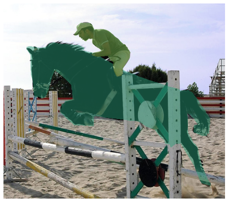

# Mask R-CNN for training and evaluating on PASCAL SBD 2012 dataset

This is a study project of the **Computer Vision** course at **University of Science HCM-VNU.**


# Referenced source
This code is heavily based on: https://github.com/matterport/Mask_RCNN


# Getting Started
If you want to validate our result or training by yourself. We've already setup all the process in the google colab link below 
Some of the examples in PASCAL SBD dataset. 



Notice that the orignal [PASCAL SBD](http://home.bharathh.info/pubs/codes/SBD/download.html) using the voc's annotation format.\
To run this code, we've converted it into coco's format. we put the prepared dataset download link in the tutorial below

# Dataset statistics
We also provide the code for examine the dataset (how many classess? or how many object and annotation in each class?).\
You can see the statistics by running
```
python dataset_stats.py --dataset="path to dataset" --subset="subset name (train or val)"
```
# Training on PASCAL SBD


```

# Train a new model starting from pretrained ImageNet 
python main.py train --dataset=data/sbd --model=imagenet

# Continue training a model that you had trained earlier
python main.py train --dataset=data/sbd --model="path to weights.h5"

# Continue training the last model you trained. This will find
# the last trained weights in the model directory.
python main.py train --dataset=/path/to/coco/ --model=last
```

We also provide 4 step alternating training scheme of Faster RCNN by running
```
python main_4stage.py train --dataset=data/sbd --model=imagenet
```

You can also run the validation on the sbd_val subset by command:
```
python main.py evaluate --dataset=data/sbd --model="path to weights.h5"
```

The training schedule, learning rate, and other hyperparameters should be set in `mrcnn/config.py`.


## Citation
Use this bibtex to cite this repository:
```
@misc{matterport_maskrcnn_2017,
  title={Mask R-CNN for object detection and instance segmentation on Keras and TensorFlow},
  author={Waleed Abdulla},
  year={2017},
  publisher={Github},
  journal={GitHub repository},
  howpublished={\url{https://github.com/matterport/Mask_RCNN}},
}
```


## Requirements
Python 3, TensorFlow 1.15, Keras 2.0.8 and **pycocotools** and other common packages listed in `requirements.txt`.


## Installation Tutorial
1. Clone this repository
2. Install dependencies
   ```bash
   pip install -r requirements.txt
   ```
3. Run setup from the repository root directory
    ```bash
    python setup.py install
    ``` 
4. Download our prepared dataset from google drive [PASCAL_SBD.zip](https://drive.google.com/file/d/1uyZtl6LDxbgHC7ctDl0rbGlxOOrvCssG/view?usp=sharing).
Extract and put it into data/sbd folder. (the folder should have sbd/imgs and <anotation_files>.json)
5. Run the desired command above for training or evaluating.
**Google Colab link demo:**


